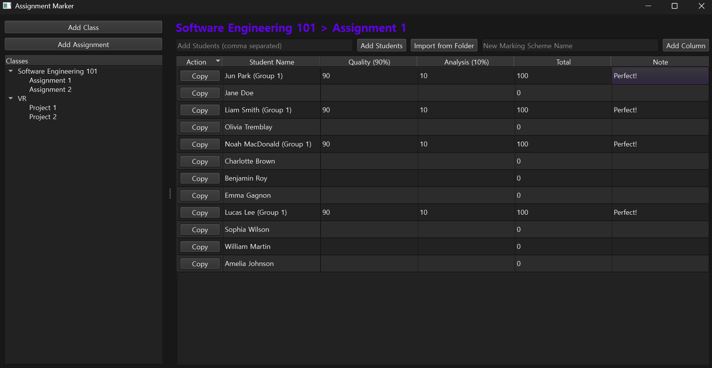

# Assignment Marker

Assignment Marker is a locally hosted, desktop-native Python application for teachers and graders to seamlessly manage their classrooms, assignments, student groupings, and grades.



## Features

- **Classroom & Assignment Management**: Organize grading per class and assignments easily through the left-hand navigation pane. New assignments intelligently auto-populate their rosters from preceding assignments in the same class to save you redundant data entry.
- **Dynamic Marking Schemes**: Add, remove, and track distinct assignments, tests, and criteria with fully modular spreadsheet columns. 
- **Auto-Calculations**: The "Total" column evaluates scores on the fly to help you see cumulative grades instantly.
- **Intelligent Student Grouping**: Group students effortlessly via right-click context menus. When grading a grouped project or shared assignment, assigning a score to *one* student in the group automatically clones and synchronizes that score and note universally across *all* connected students in the same group.
- **Batch Import Architecture**: You can manually batch-add students by typing their names separated by commas, or you can use the **"Import from Folder"** feature to point the application to an unzipped assignment submissions folder and it will perfectly reconstruct the student's names and add them to your roster mechanically.

    Submissions Folder Name Format: `[StudentName]_[...]` 
    `_` is used to separate the student name from the rest of the folder name.
    
- **Clipboard Integration**: Easily copy their row details (including marks, totals, and notes) instantly into your system clipboard in clean text.
- **Robust Persistence**: Operates entirely stateless offline; everything saves autonomously to a local JSON file (`data.txt`) so your progress is guaranteed safe between sessions.

## Setup

1. **Prerequisites**: Ensure you have Python 3 installed.
2. **Install Dependencies**: Open a terminal in the project directory and invoke:
   ```bash
   pip install -r requirements.txt
   ```
   *This will install the internal GUI framework libraries (PySide6).*
3. **Run the Application**: With dependencies installed, simply run the main file to spin up the UI:
   ```bash
   python main.py
   ```

## Development

- `main.py`: Houses the core initialization, application style sheets, and window manager loop.
- `src/main_window.py`: Contains the PySide6 views, delegates layout models (`QTableView`, `QTreeView`, etc), and context menu logic.
- `src/app_state.py`: Manages centralized global application state, handling calculations, persistence (saves), duplicate validations, group bindings, and memory management.
- `src/models.py`: Structural definitions framing the overarching Python domain `dataclasses` (such as `Classroom`, `Student`, `MarkingScheme`, etc).
